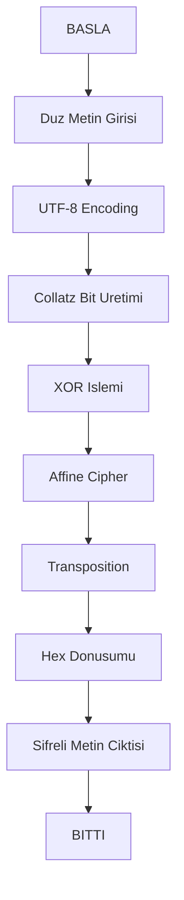
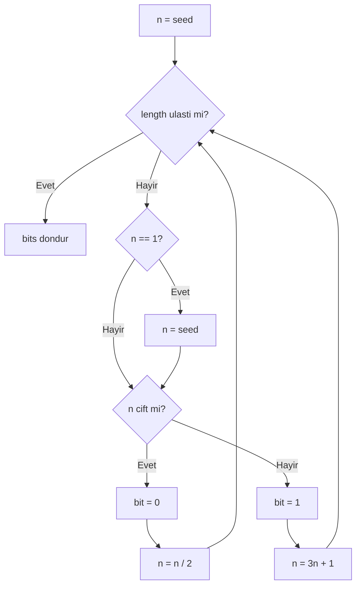
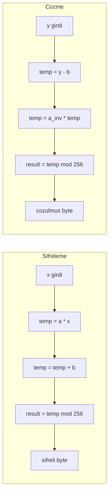

# AKIS SEMASI (FLOWCHART)

## Collatz Tabanli Kriptografik Algoritma

---

## 1. ANA SIFRELEME AKISI

```
┌─────────────────────────────────────────────────────────────────────┐
│                        BASLA                                        │
└─────────────────────────────────────────────────────────────────────┘
                                │
                                ▼
┌─────────────────────────────────────────────────────────────────────┐
│                    GIRDI: Duz Metin (Plaintext)                     │
│                    Anahtarlar: seed, a, b, trans_key                │
└─────────────────────────────────────────────────────────────────────┘
                                │
                                ▼
┌─────────────────────────────────────────────────────────────────────┐
│                 ADIM 1: UTF-8 ENCODING                              │
│                 Metin -> Byte Dizisi                                │
│                 "AB" -> [65, 66]                                    │
└─────────────────────────────────────────────────────────────────────┘
                                │
                                ▼
┌─────────────────────────────────────────────────────────────────────┐
│                 ADIM 2: COLLATZ XOR                                 │
│                 ┌─────────────────────────────────┐                 │
│                 │ Collatz Dizisi Uret             │                 │
│                 │ n cift -> 0, n tek -> 1         │                 │
│                 │ Bitler -> Byte donusumu         │                 │
│                 └─────────────────────────────────┘                 │
│                 data = data XOR collatz_bytes                       │
└─────────────────────────────────────────────────────────────────────┘
                                │
                                ▼
┌─────────────────────────────────────────────────────────────────────┐
│                 ADIM 3: AFFINE CIPHER                               │
│                 ┌─────────────────────────────────┐                 │
│                 │ Her byte icin:                  │                 │
│                 │ E(x) = (a * x + b) mod 256      │                 │
│                 └─────────────────────────────────┘                 │
└─────────────────────────────────────────────────────────────────────┘
                                │
                                ▼
┌─────────────────────────────────────────────────────────────────────┐
│                 ADIM 4: TRANSPOSITION                               │
│                 ┌─────────────────────────────────┐                 │
│                 │ Veriyi bloklara bol             │                 │
│                 │ Her blogu key sirasina gore    │                 │
│                 │ yeniden duzenle                 │                 │
│                 └─────────────────────────────────┘                 │
└─────────────────────────────────────────────────────────────────────┘
                                │
                                ▼
┌─────────────────────────────────────────────────────────────────────┐
│                 ADIM 5: HEX DONUSUMU                                │
│                 Byte Dizisi -> Hex String                           │
│                 [73, 0, 182, 0] -> "4900b600"                       │
└─────────────────────────────────────────────────────────────────────┘
                                │
                                ▼
┌─────────────────────────────────────────────────────────────────────┐
│                 CIKTI: Sifreli Metin (Ciphertext)                   │
│                 + Metadata (orijinal uzunluk, bit dagilimi)         │
└─────────────────────────────────────────────────────────────────────┘
                                │
                                ▼
┌─────────────────────────────────────────────────────────────────────┐
│                        BITTI                                        │
└─────────────────────────────────────────────────────────────────────┘
```

---

## 2. SIFRE COZME AKISI

```
┌─────────────────────────────────────────────────────────────────────┐
│                        BASLA                                        │
└─────────────────────────────────────────────────────────────────────┘
                                │
                                ▼
┌─────────────────────────────────────────────────────────────────────┐
│                 GIRDI: Sifreli Hex String                           │
│                 Anahtarlar: seed, a, b, trans_key                   │
│                 Orijinal Uzunluk                                    │
└─────────────────────────────────────────────────────────────────────┘
                                │
                                ▼
┌─────────────────────────────────────────────────────────────────────┐
│                 ADIM 1: HEX -> BYTE                                 │
│                 "4900b600" -> [73, 0, 182, 0]                       │
└─────────────────────────────────────────────────────────────────────┘
                                │
                                ▼
┌─────────────────────────────────────────────────────────────────────┐
│                 ADIM 2: TRANSPOSITION (TERS)                        │
│                 Ters anahtar siralamasi uygula                      │
└─────────────────────────────────────────────────────────────────────┘
                                │
                                ▼
┌─────────────────────────────────────────────────────────────────────┐
│                 ADIM 3: AFFINE CIPHER (TERS)                        │
│                 D(y) = a^(-1) * (y - b) mod 256                     │
└─────────────────────────────────────────────────────────────────────┘
                                │
                                ▼
┌─────────────────────────────────────────────────────────────────────┐
│                 ADIM 4: COLLATZ XOR                                 │
│                 Ayni XOR islemi (terslenebilir)                     │
└─────────────────────────────────────────────────────────────────────┘
                                │
                                ▼
┌─────────────────────────────────────────────────────────────────────┐
│                 ADIM 5: UTF-8 DECODE                                │
│                 Byte -> Metin + Padding kaldir                      │
└─────────────────────────────────────────────────────────────────────┘
                                │
                                ▼
┌─────────────────────────────────────────────────────────────────────┐
│                 CIKTI: Duz Metin (Plaintext)                        │
└─────────────────────────────────────────────────────────────────────┘
                                │
                                ▼
┌─────────────────────────────────────────────────────────────────────┐
│                        BITTI                                        │
└─────────────────────────────────────────────────────────────────────┘
```

---

## 3. COLLATZ BIT URETIMI

```
┌─────────────────┐
│   n = seed      │
└────────┬────────┘
         │
         ▼
┌─────────────────┐
│  length'e       │
│  ulasildi mi?   │
└────────┬────────┘
    │         │
   EVET      HAYIR
    │         │
    ▼         ▼
┌───────┐   ┌─────────────────┐
│ DONDUR│   │    n == 1 ?     │
│ bits  │   └────────┬────────┘
└───────┘       │         │
              EVET      HAYIR
                │         │
                ▼         ▼
          ┌─────────┐   ┌─────────────────┐
          │n = seed │   │  n cift mi?     │
          └────┬────┘   └────────┬────────┘
               │            │         │
               │          EVET      HAYIR
               │            │         │
               │            ▼         ▼
               │      ┌─────────┐ ┌─────────┐
               │      │bits <- 0│ │bits <- 1│
               │      │n = n/2  │ │n = 3n+1 │
               │      └────┬────┘ └────┬────┘
               │           │           │
               └───────────┴───────────┘
                           │
                           └──────────────────┐
                                              │
                                    (tekrar yukari)
```

---

## 4. AFFINE CIPHER DETAY

```
        SIFRELEME                           SIFRE COZME
┌─────────────────────┐             ┌─────────────────────┐
│   GIRDI: byte x     │             │   GIRDI: byte y     │
└─────────┬───────────┘             └─────────┬───────────┘
          │                                   │
          ▼                                   ▼
┌─────────────────────┐             ┌─────────────────────┐
│    temp = a * x     │             │   temp = y - b      │
└─────────┬───────────┘             └─────────┬───────────┘
          │                                   │
          ▼                                   ▼
┌─────────────────────┐             ┌─────────────────────┐
│   temp = temp + b   │             │  temp = a^(-1)*temp │
└─────────┬───────────┘             └─────────┬───────────┘
          │                                   │
          ▼                                   ▼
┌─────────────────────┐             ┌─────────────────────┐
│  result = temp % m  │             │  result = temp % m  │
└─────────┬───────────┘             └─────────┬───────────┘
          │                                   │
          ▼                                   ▼
┌─────────────────────┐             ┌─────────────────────┐
│   CIKTI: result     │             │   CIKTI: result     │
└─────────────────────┘             └─────────────────────┘
```

---

## 5. TRANSPOSITION DETAY

```
         ANAHTAR: "3142"
         ┌───┬───┬───┬───┐
         │ 3 │ 1 │ 4 │ 2 │
         └───┴───┴───┴───┘
              │
              ▼
         SIRALAMA (kucukten buyuge):
         1->poz 2, 2->poz 4, 3->poz 1, 4->poz 3
              │
              ▼
         YENI SIRA: [2, 4, 1, 3] (1-indexed)
                  : [1, 3, 0, 2] (0-indexed)
              │
              ▼
    ┌─────────────────────────────────────┐
    │         SIFRELEME ORNEGI            │
    │                                     │
    │  Orijinal:  A   B   C   D           │
    │  Pozisyon:  0   1   2   3           │
    │                                     │
    │  Yeni poz:  1   3   0   2           │
    │  Sonuc:     B   D   A   C           │
    │                                     │
    │  Pozisyon:  0   1   2   3           │
    │  Sifreli:   B   D   A   C           │
    └─────────────────────────────────────┘
```

---

## 6. MERMAID DIAGRAM



---

## 7. COLLATZ BIT URETIMI - MERMAID



---

## 8. AFFINE CIPHER - MERMAID



---

## 9. ANAHTAR URETIMI AKISI

```
┌─────────────────────────────────────────┐
│              BASLA                      │
└────────────────┬────────────────────────┘
                 │
                 ▼
┌─────────────────────────────────────────┐
│  Collatz Seed Uret                      │
│  seed = SecureRandom(10, 1000)          │
└────────────────┬────────────────────────┘
                 │
                 ▼
┌─────────────────────────────────────────┐
│  Affine Parametreleri Uret              │
│  a = RandomCoprime(256)                 │
│  b = SecureRandom(0, 255)               │
│  a_inv = ModInverse(a, 256)             │
└────────────────┬────────────────────────┘
                 │
                 ▼
┌─────────────────────────────────────────┐
│  Transposition Key Uret                 │
│  key = Shuffle([1,2,3,4])               │
└────────────────┬────────────────────────┘
                 │
                 ▼
┌─────────────────────────────────────────┐
│  CIKTI: {seed, a, b, a_inv, key}        │
│  Format: "27:5:8:3142"                  │
└────────────────┬────────────────────────┘
                 │
                 ▼
┌─────────────────────────────────────────┐
│              BITTI                      │
└─────────────────────────────────────────┘
```
